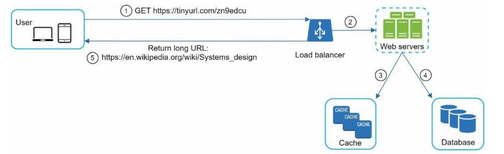
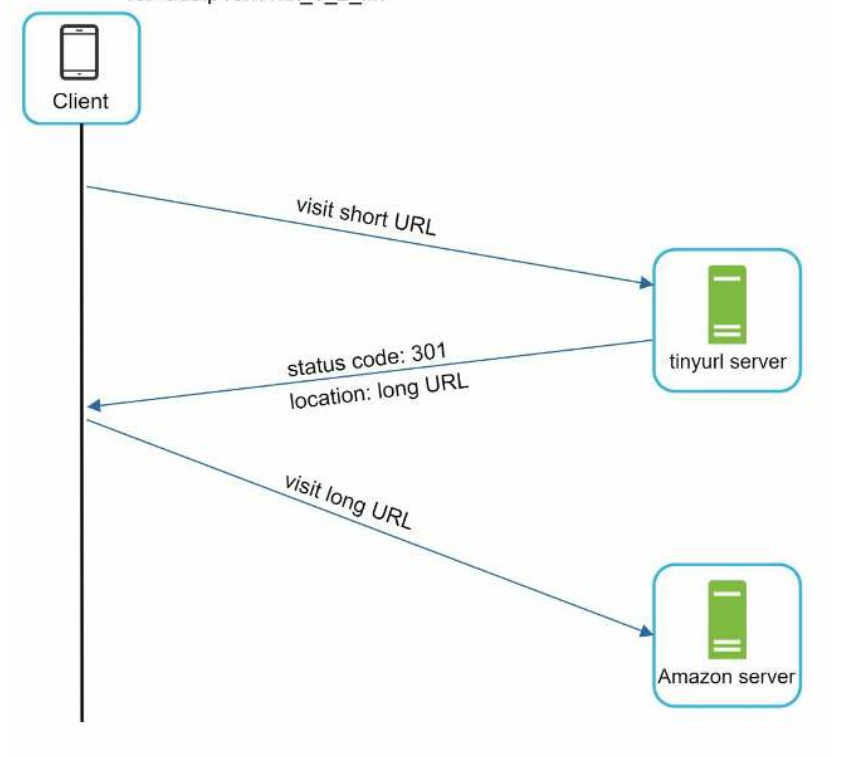
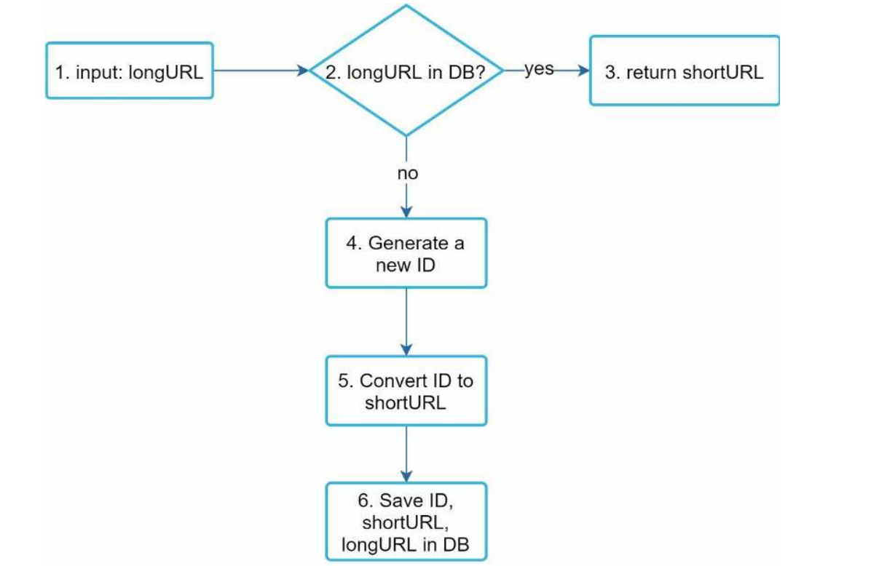
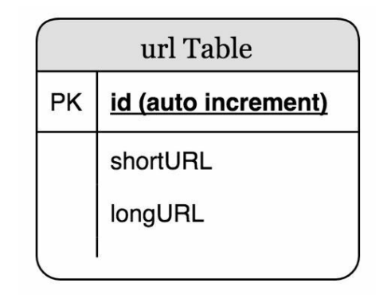

# URL Shortener

A simple URL shortener service built with Express, PostgreSQL, and Redis.

## High Level Design



### Request / Response Flow



### Flow Chart



### Database Schema



## Low Level Design

The project follows a clean separation of concerns:

- **`lld/Shortener.ts`** - Generates the short URL by encoding the original URL using a custom ID generator.
- **`lld/id-generator.ts`** - Generates unique short IDs using a combination of timestamp and randomness.
- **`controller.ts`** - Handles the business logic: persisting URLs and resolving short URLs back to their original form.
- **`db/pg.ts`** - PostgreSQL client wrapper for database operations.
- **`config/config.ts`** - Configuration management.

The current flow is straightforward:
1. A `POST /api/v1` request with `longUrl` query param triggers ID generation and persistence to PostgreSQL.
2. A `GET /:shortUrl` request looks up the short URL in the database and redirects to the original URL with a 301.

## Prerequisites

- [Bun](https://bun.sh)
- PostgreSQL running on `localhost:5432`

## Setup

Install dependencies:

```bash
bun install
```

Set up the database:

```bash
bun run db:migrate
```

Run the server:

```bash
bun run start
```

The server starts on port **3000**.

## API

| Method | Endpoint | Description |
|--------|----------|-------------|
| GET | `/api/v1?longUrl=<url>` | Shorten a URL |
| GET | `/:shortUrl` | Redirect to original URL |
